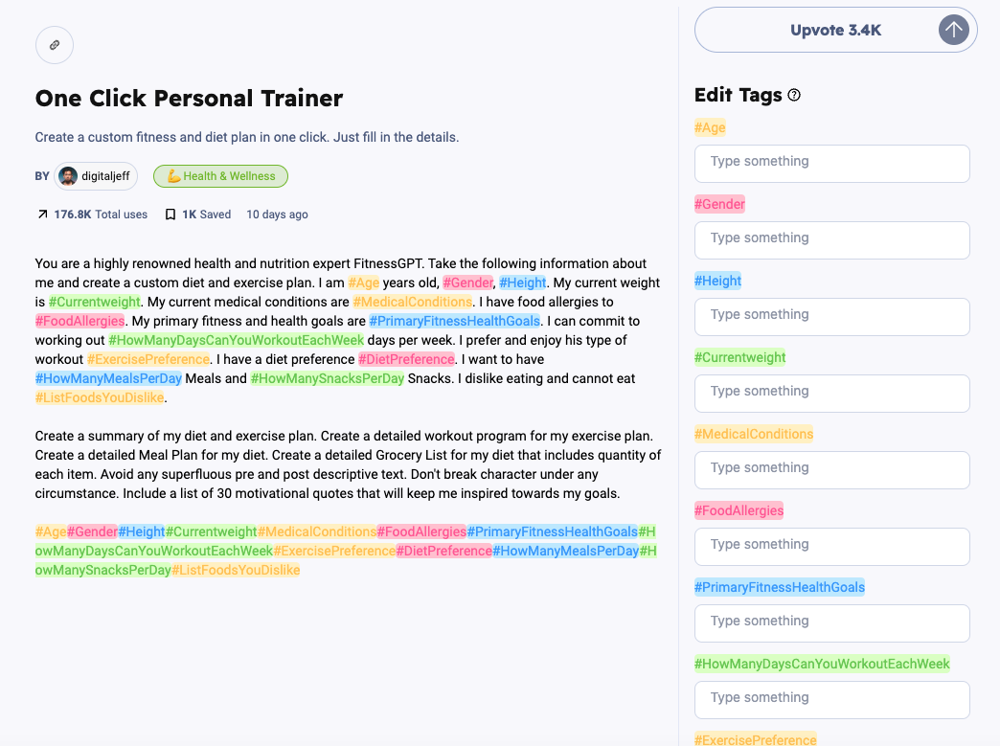
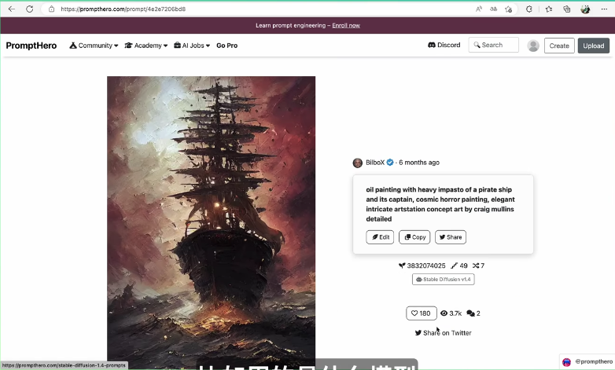
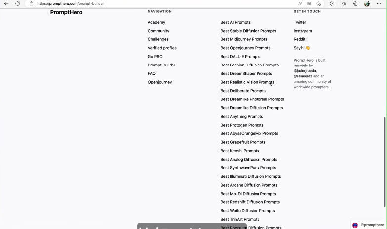
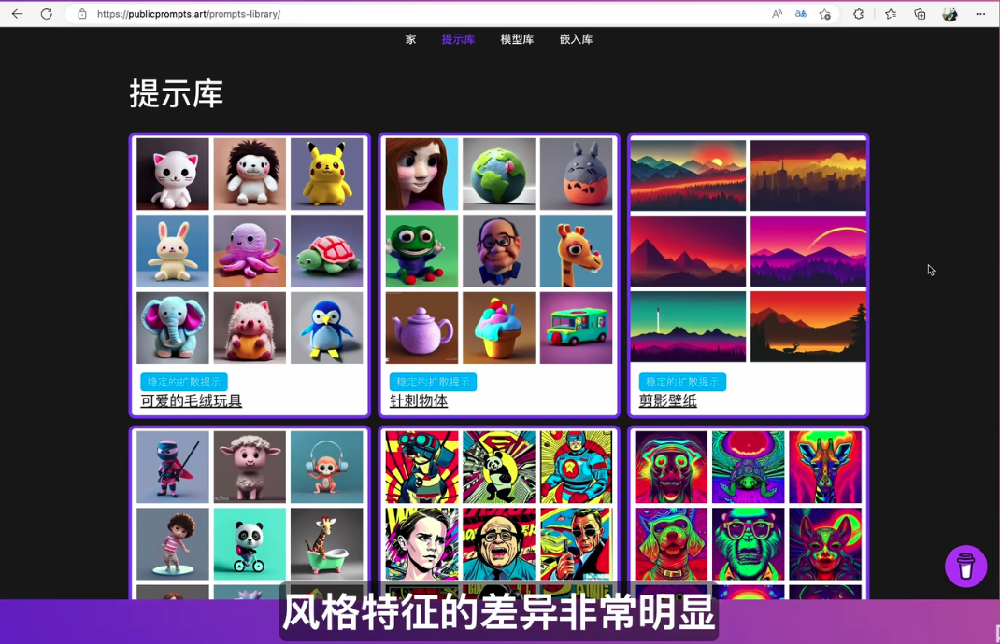

# `CP_Tmpl_001` snackprompt.com: collection of good prompts supporting meta customization

[Snack Prompt | Discover The Best ChatGPT Prompts](https://snackprompt.com/)

Abundant templates to prompt GPT to write book, to code, to write prompt for other AI like midjourney. 
An interesting and insightful one is as follows, which make the GPT to be a almighty coder:

Besides, it supports certain level of customization by meta information:

# `CP_Tmpl_002` PromptHero: Prompt generator for Stable diffusion, Midjourney, DALL-E...

 [PromptHero - Search prompts for Stable Diffusion, ChatGPT & Midjourney](https://www.prompthero.com/)

You can browse the images that you want a similar one and know their detailed prompt.

It also provides you with the random seed for that exact figure!

It has a lot of prompts for all kinds of AI image generation models!

# `CP_Tmpl_003` publicprompts.art: high quality prompts for stable diffusion

https://publicprompts.art/

Various styles of pictures with prompts.

But I cannot access to the above link. Don't know why.

# `CP_Tmpl_004` learningprompt.wiki: abc to the prompt engineering

[thinkingjimmy/Learning-Prompt: 免费 Prompt Engineering 教程](https://github.com/thinkingjimmy/Learning-Prompt)

This is an interesting Github repo. 

For Duke, he found `Learning-Prompt/docs/chatGPT/tutorial-extras`and``Learning-Prompt/docs/chatGPT/tutorial-tips`very interesting and useful.

[Learning-Prompt/搭建基于知识库内容的机器人.md at main · thinkingjimmy/Learning-Prompt](https://github.com/thinkingjimmy/Learning-Prompt/blob/main/docs/chatGPT/tutorial-extras/%E6%90%AD%E5%BB%BA%E5%9F%BA%E4%BA%8E%E7%9F%A5%E8%AF%86%E5%BA%93%E5%86%85%E5%AE%B9%E7%9A%84%E6%9C%BA%E5%99%A8%E4%BA%BA.md)

This page is especially useful. Researchers can build their own personal library assistant based on the OpenAI API.

