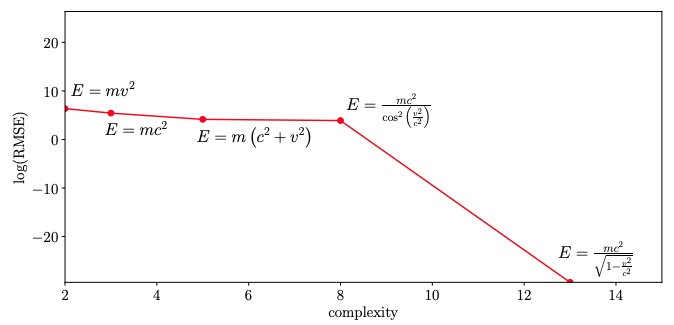
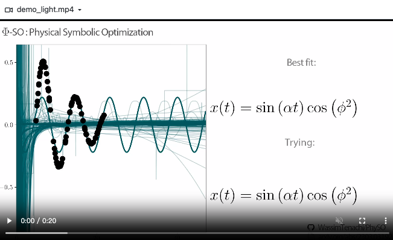

# AI Theorem Derivation

## `FP_TD_001` Deep symbolic regression for finding physics formula from data

Gist: $\Phi$-SO, a Physical Symbolic Optimization framework for recovering analytical symbolic expressions from physics data using deep reinforcement learning techniques by learning units constraints.

Submitted to **The Astrophysical Journal**

From **Universit´e de Strasbourg**, France

[Arxiv Paper](https://arxiv.org/pdf/2303.03192.pdf)

[Github--PhySO: Physical Symbolic Optimization](https://github.com/WassimTenachi/PhySO)

