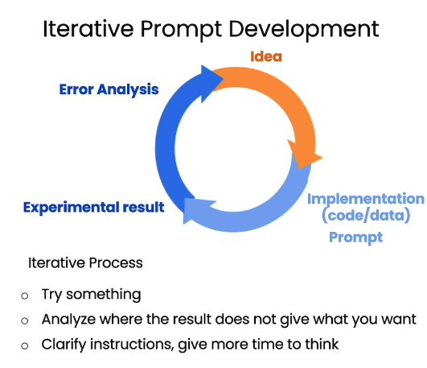
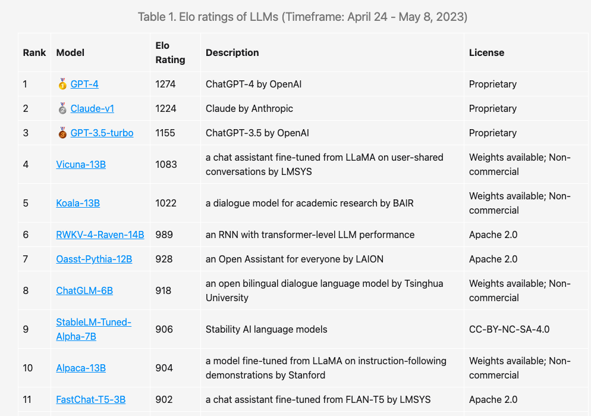

# General Introduction to AIGC Technology

Rating of the contents

| Name                                          | Rating | Keywords                       | Date       | Ref       |
| --------------------------------------------- | ------ | ------------------------------ | ---------- | --------- |
| Generative Model Can Revolutionize Industries | 🌟🌟🌟🌟🌟  | Jensen Huang; Industry; NVIDIA | 2023-03-28 | GI_HF_001 |
|                                               |        |                                |            |           |
|                                               |        |                                |            |           |

## What AIGC is

## How far AIGC will go

### GI_HF_001: Generative Model Can Revolutionize Industries

rate:: 🌟🌟🌟🌟🌟

Video: [黄仁勋 生成式AI将重塑几乎所有行业](https://www.bilibili.com/video/BV1Hs4y1J7vf/?share_source=copy_web&vd_source=ec326eb231ce641ac970740d9f56f05c)

#### Contents:

In this video, Jensen Huang gave a short talk about how generative AI model can revolutionize the industries.

He listed some interesting websites:

- [Debuild - Build web apps fast](https://debuild.app/): on demand Web design and deployment 

- [Grammarly](https://app.grammarly.com/): Writing helper that considers the context.

- [AI assistant for software developers | Tabnine](https://www.tabnine.com/): Help developer write code
- [Omneky - Personalized Design:Omneky](https://www.omneky.com/): Customize Ads and copies
- [AI-Optimized Customer and Employee Experiences - Kore.ai](https://kore.ai/): Virtual customer service agent
- [Jasper - Try For Free](https://www.jasper.ai/free-trial?_from=ads&fp_sid=1-g-CjwKCAjw3POhBhBQEiwAqTCuBv6vmasjLJsdhI3wzvfLV26sWD3v9NF43wJfPCoKCqvsJ8gLu6JYLRoC5VQQAvD_BwE): Generate marketing materials, reducing the time to generate the first draft by 80%
- [Insilico Medicine](https://insilico.com/): AI for drug design, every step of pharmaceutical research and development.
- [Biologics Drug Discovery | Absci](https://www.absci.com/): Using AI to predict antibody medicine

He announced the **NVIDIA AI FOUNDATIONS**, a cloud service for build, refine, and operate large generative model for companies.

[Generative AI for Enterprise | NVIDIA](https://www.nvidia.com/en-sg/ai-data-science/generative-ai/)

## How to prompt GPT

### GI_HF_002: ChatGPT Prompt Engineering by Andrew Ng

[01.课程简介_ChatGPT提示工程_吴恩达 & OpenAI_哔哩哔哩_bilibili](https://www.bilibili.com/video/BV1fk4y1J7Af/?spm_id_from=333.999.0.0&vd_source=57ac3ae5415445af2ffe1e61e1722d73)

In this video, Ng focuses on teaching you to use GPT to boost application development.

First, you will learn some best prompting practices.

Then, you will learn some use cases, like summarizing, inferring, transforming, expanding.

Next, you will build a ChatBot using the LLM

#### Important Notes

*Difference between Base LLM and Instruction Tuned LLM*

This video uses OpenAI API in python with Jupyter Notebook, where the GPT-3.5-Turbo is employed. But you can use the same principles in chatting with ChatGPT or GPT4 in the OpenAI website.

Two principles for writing prompt:

- **Write clear and specific instruction**
  -  Clear prompt is not a short prompt. Usually a longer prompt contains more context for the model to learn and will lead to better outcomes.
  - Tactic 1: Use delimiters to let the model know where you want it to concentrate
  - Tactic 2: Ask for structured output
    - `Provde them in JSON format with the following keys: book_id, title, author, genre.`
  - Tactic 3: Ask the model to check whether conditions are satisfied
    - 
  - Tactic 4: Few shot prompting--Give successful examples of completing tasks. Then ask model to perform the task
    - 
    - I'd say quite amazing that the model does learn!

- **Give the model time to think**
  - Tactic: Specify the steps to complete a task
    - `Perform the following actions for the texts within delimiters """. 1 -- xxx. 2 -- xxx`
    - 
  - Tactic: Instruct the model to work out its own solution before rushing to a conclusion
    - For example, if you let the model to check if a solution is correct for the question, then rather than let the model to give the answer directly, you can ask the model to get a solution itself, and check if it is consistent with the student's answer.
    - 
    - This prompt is just wrote really clear.
  - Tactic: reduce hallucination
    - First, let the model find relevant information.
    - Then, let the model answer the question based on the relevant information.

### Iterative Prompt Development

The basic idea is to keep modifying the prompt until the LLM provides the result you want.

 

Duke thinks the prompt engineering with LLM is just like being a good Boss. You either know want you want very specifically or try to gradually find it out with your team. Otherwise, you wont get a good job done.

## Ranking of LMM Models by LMSYS ORG

[LMSYS公布LLM性能排名持续更新 GPT-4排名第一，Palm2还未测_哔哩哔哩_bilibili](https://www.bilibili.com/video/BV1Pm4y187ji/?spm_id_from=333.999.0.0&vd_source=57ac3ae5415445af2ffe1e61e1722d73)

Official website: [LMSYS Org](https://lmsys.org/)

This is a website project held by UC Berkeley. It contains some small scale LM including the 3B FastChat-T5 model and the 7B and 13B Vicuna model.

It also contains a evaluation arena for the LLMs and a open and scalable platform for training, finetuning, serving, and evaluating LLM-based chatbots.

The ranking it provides by using the Chatbot Arena can be found here: [Chatbot Arena Leaderboard Updates (Week 2) | LMSYS Org](https://lmsys.org/blog/2023-05-10-leaderboard/)

The method to evaluate the models is by pair-wise matching, which results in a Win Fraction Matrix.

