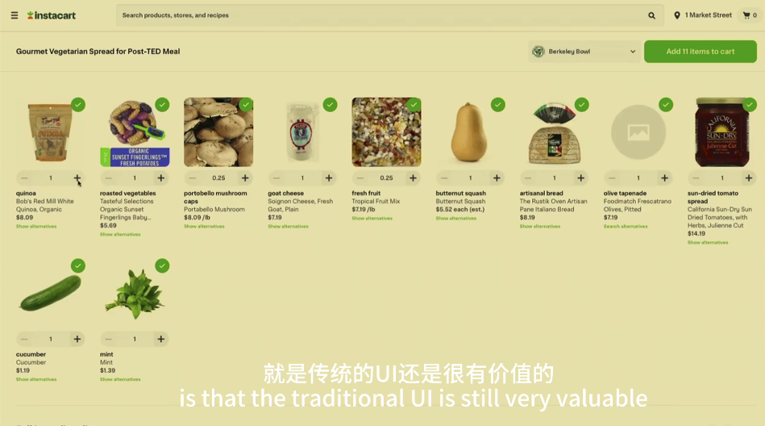
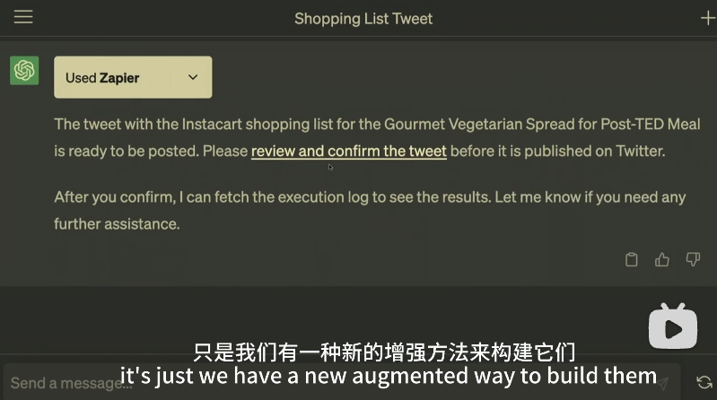
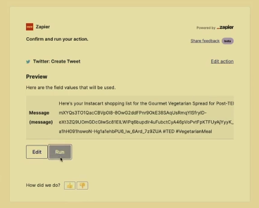
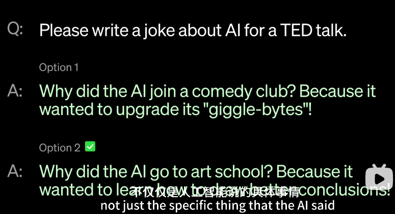
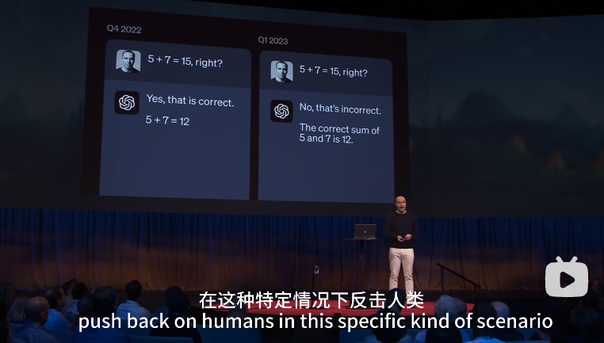

# TED--Greg Brockman--Official AutoGPT

Chinese Brief: [OpenAI现场演示官方版AutoGPT！创作画画发推一条龙，自主调用外部应用完成任务](https://mp.weixin.qq.com/s/rMS8IdS0qdq6Y2nl-UM-Ew)

Video: [Open AI 联合创始人 Greg Brockman 在 TED 大会现场演讲视频_哔哩哔哩_bilibili](https://www.bilibili.com/video/BV1514y1f74G/?spm_id_from=333.788.top_right_bar_window_history.content.click&vd_source=57ac3ae5415445af2ffe1e61e1722d73)

## Notes of the Video

### Demonstration of GPT+Plugin

> Today I want to show you the current state of (OpenAI GPT) technology and some of the underlying design principles we hold dear.

In first example, he showed how to use a DALL-E2 plugin to let GPT to create a suggestion for a meal and then draw a picture according to the suggestion.

*The generated image*

Then, he asked the GPT to make a shopping list for the food inside the above picture and tweet it out for the TED viewers.

*AI using plugin*

*Results of the shopping listed created by GPT*

> By having this unified language interface on top of the tools the AI is able to take away all the details from you.

> Traditional UI will not go away. It's just we have a new augmented way to build them.

*GPT uses Zapler Plugin to tweet*

*The tweet generated*

### Explain How They Build This

> To train GPT, its a two step process.
>
> 1st we produce what Touring would have called a child machine through an unsupervised learning process. We just show it the whole world of Internet and say predict what comes next and text you've never seen before. And this process imbues it with all sorts of wonderful skills.
>
> 2nd step, teach the AI what to do with the skills (that it have learned through unsupervised learning), and for this we provide feedback. We have the AI try out multiple things, give us multiple suggestions and then human rates them says this one's better than that one.

*Human feedbacks which option is better*

> This allows the AI to generalize, to infer your intent, and to be applied in scenarios that it has not seen before.

Some times, things we do not generally expect to teach the AI are important, for example, simple math.

*Teach AI to say when human is wrong*

It is then very important to obtain **high quality feedback**.

> Now, providing high quality feedback is a hard thing

Simple Loss function will lead to unsatisfactory performance, it even will result the AI to cheat.

*If you teach a kid to clean a floor and if all you check is the cleaness of the floor, this may happen.*

AI itself can be used to produce those high quality feedbacks.

%TODO [2023年4月24日 00:11:07, JHu]: https://www.bilibili.com/video/BV1514y1f74G?t=513.1

 