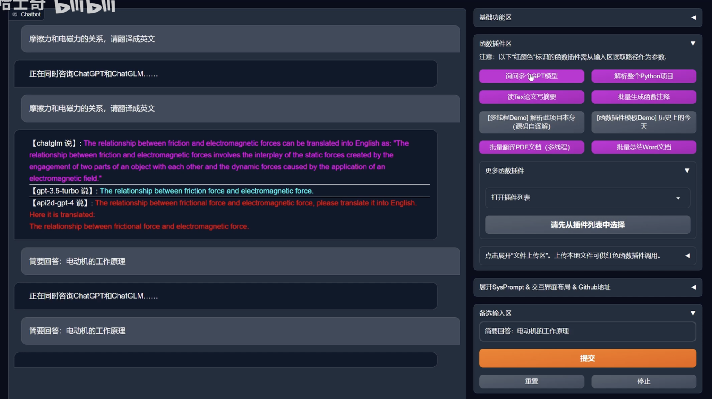

# Online Video Resources

Here, we list the online video resources that are relevant to our paper on AIGC for research.

## General Introduction of AIGC

### Generative Model Can Revolutionize Industries

rate:: 🌟🌟🌟🌟🌟

Video: [黄仁勋 生成式AI将重塑几乎所有行业](https://www.bilibili.com/video/BV1Hs4y1J7vf/?share_source=copy_web&vd_source=ec326eb231ce641ac970740d9f56f05c)

#### Contents:

In this video, Jensen Huang gave a short talk about how generative AI model can revolutionize the industries.

He listed some interesting websites:

- [Debuild - Build web apps fast](https://debuild.app/): on demand Web design and deployment 

- [Grammarly](https://app.grammarly.com/): Writing helper that considers the context.

- [AI assistant for software developers | Tabnine](https://www.tabnine.com/): Help developer write code
- [Omneky - Personalized Design:Omneky](https://www.omneky.com/): Customize Ads and copies
- [AI-Optimized Customer and Employee Experiences - Kore.ai](https://kore.ai/): Virtual customer service agent
- [Jasper - Try For Free](https://www.jasper.ai/free-trial?_from=ads&fp_sid=1-g-CjwKCAjw3POhBhBQEiwAqTCuBv6vmasjLJsdhI3wzvfLV26sWD3v9NF43wJfPCoKCqvsJ8gLu6JYLRoC5VQQAvD_BwE): Generate marketing materials, reducing the time to generate the first draft by 80%
- [Insilico Medicine](https://insilico.com/): AI for drug design, every step of pharmaceutical research and development.
-  [Biologics Drug Discovery | Absci](https://www.absci.com/): Using AI to predict antibody medicine

He announced the **NVIDIA AI FOUNDATIONS**, a cloud service for build, refine, and operate large generative model for companies.

[Generative AI for Enterprise | NVIDIA](https://www.nvidia.com/en-sg/ai-data-science/generative-ai/)

## AIGC for Research Illustration

### AI Vedio Generation -- CVPR 2023

Link: [CVPR 2023|基于草图图像检索_哔哩哔哩_bilibili](https://www.bilibili.com/video/BV15o4y1H7LA/?spm_id_from=333.999.0.0)

#### Contents

Paper title: Video probabilistic diffusion models in projected latent space.

Use diffusion model to generate short videos.

### AI Powerpoint Presentation Generation

Link: [打工人利器！AI 生成 PPT，目前市场上最实用的PPT生成网站_哔哩哔哩_bilibili](https://www.bilibili.com/video/BV14M4y1U7wU/?spm_id_from=333.999.0.0&vd_source=57ac3ae5415445af2ffe1e61e1722d73)

It introduces a AI ppt generation webside: [Gamma](https://gamma.app/)

Jingzhi tried to use it to generate a PPT about "AIGC to boost academic researches", and here's what he got: [AI Genereated PPT](https://gamma.app/docs/AIGC-for-Boosting-Academic-Researches-alvtmnp0ozxinlu)

Seems it is right on the points and is beautiful, while the content are not very adequate.

## AIGC for Scientific Calculation

### ChatGPT + Mathematica Helps Scientific Calculation

#Doing

Link: [ChatGPT+Mathematica集成，完美解决之前计算能力差的问题_哔哩哔哩_bilibili](https://www.bilibili.com/video/BV1ov4y1G7hv/?spm_id_from=333.999.0.0&vd_source=57ac3ae5415445af2ffe1e61e1722d73)

#### Contents

The video contains a short talk, which involves the famous Dr. Wolfram that created Mathematica Software.

## AIGC for Construct Proposition and Theorem

### Generative model helps find Physcis formula

#Doing

Link: [用AI来发现物理公式，是真的恐怖，算力不需要特别多，代码1.2k星标_哔哩哔哩_bilibili](https://www.bilibili.com/video/BV1Bo4y1W7Er/?spm_id_from=333.999.0.0&vd_source=57ac3ae5415445af2ffe1e61e1722d73)

#### Contents

## Existing Integration of AIGC for Academic Research

### chatgpt-academic v3.1 (THUglm+gpt3.5+gpt4)

Vedio: [chatgpt-academic v3.1多模型统合测试（清华glm+gpt3.5+gpt4）_哔哩哔哩_bilibili](https://www.bilibili.com/video/BV1wT411p7yf/?spm_id_from=333.999.0.0&vd_source=57ac3ae5415445af2ffe1e61e1722d73)

It contains many impressive applications.

To name a few that are of particular interest:

- Ask multiple LLM and summary their results automatically.
- Analyze a whole Python project.
- Read Tex file of technical article and generate abstract.
- Generate comments for function in a batch manner.
- Summary word files in a batch manner.

