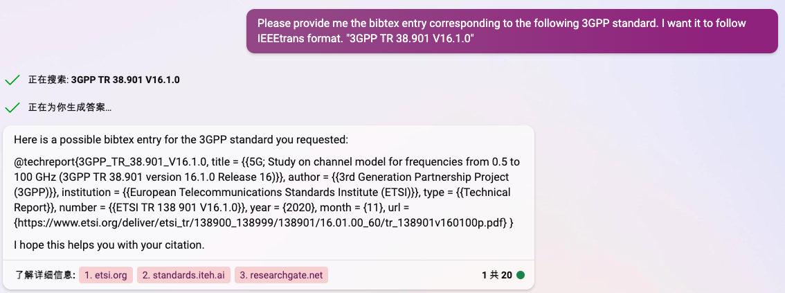

# AI Helps Finding Reference

Rating of the contents

| Name      | Rating | Keywords               | Date | Ref       |
| --------- | ------ | ---------------------- | ---- | --------- |
| Consensus | 🌟🌟     | Evidence-based answers |      | ST_FR_001 |
|           |        |                        |      |           |
|           |        |                        |      |           |

[🌟🌟 Consensus: Evidence-Based Answers, Faster ](#`ST_FR_001` Consensus: Evidence-Based Answers, Faster)

[🌟🌟🌟🌟 Elicit: The AI Research Assistant](#`ST_FR_002` Elicit: The AI Research Assistant)


## `ST_FR_001` Consensus: Evidence-Based Answers, Faster

[强烈推荐科研AI神器Consensus！助你阅读、提炼、发现效率显著提升！_哔哩哔哩_bilibili](https://www.bilibili.com/video/BV1bM4y1a7vW/?spm_id_from=333.999.0.0&vd_source=57ac3ae5415445af2ffe1e61e1722d73)


[Consensus - Evidence-Based Answers, Faster](https://consensus.app/)

Consensus is a search engine that uses AI to extract and distill findings directly from scientific research, in order to answer your academic questions.

### Duke's Initial Trial:

[What are the state-of-the-art methods to perform prediction tasks for irregularly sampled time series?](https://consensus.app/results/?q=What%20are%20the%20state-of-the-art%20methods%20to%20perform%20prediction%20tasks%20for%20irregularly%20sampled%20time%20series%3F&synthesize=on&year_min=2020)

Jingzhi: Useable, but not very reliable. Many important works are missing. Could be used as the first-search for literature.

Another very useful thing is that it can give you reference-supported answer for yes-or-no questions.

It is more reliable than other auto surveying method because its reference are technical articles.


It also provides some important features of the paper that us researchers may interested in, e.g., highly cited, RCT, systematic review.


But the database and articles that are being covered maybe not quite enough, compared to `Elicit` in `ST_FR_002`


## `ST_FR_002` Elicit: The AI Research Assistant

[Elicit: The AI Research Assistant](https://elicit.org/)

Elicit can find relevant papers without perfect keyword match, summarize takeaways from the paper specific to your question, and extract key information from the papers.

### Duke's Initial Trial:

Qustion: What are the state-of-the-art methods to perform prediction tasks for irregularly sampled time series?

Jingzhi: Compared to Consensus, it has an advanced Filter to select keywords and study types. The results it got are more comprehensive. More important and relevant works are provided. I'd say it is very helpful.

%TODO [2023年4月23日 14:45:12, JHu]: 展示一张界面图片


## `ST_FR_003` New Bing

#### Ask New Bing to find 3GPP standard and fetch a bibtex entry

```text
Please provide me the bibtex entry corresponding to the following 3GPP standard. I want it to follow IEEEtrans format.
"3GPP TR 38.901 V16.1.0"
```



Very helpful! Before, I always find it hard to serach for 3GPP standard. Now I have the url.
