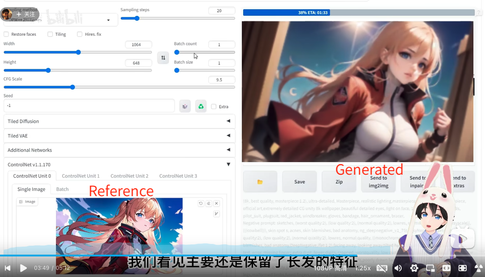
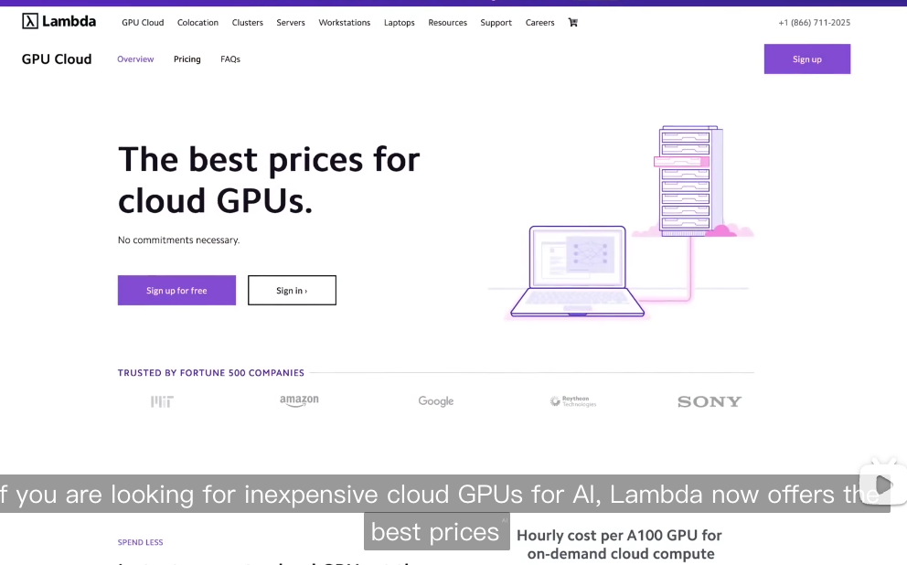

# AI Helps Perform Presentations

## `ST_PP_001` Gamma: Generate PPT for a given subject

Link: [打工人利器！AI 生成 PPT，目前市场上最实用的PPT生成网站_哔哩哔哩_bilibili](https://www.bilibili.com/video/BV14M4y1U7wU/?spm_id_from=333.999.0.0&vd_source=57ac3ae5415445af2ffe1e61e1722d73)

It introduces a AI ppt generation webside: [Gamma](https://gamma.app/)

### Duke's Initial Trial

Duke tried to use it to generate a PPT about "AIGC to boost academic researches", and here's what he got: [AI Genereated PPT](https://gamma.app/docs/AIGC-for-Boosting-Academic-Researches-alvtmnp0ozxinlu)

Seems it is right on the points and is beautiful, while the content are not very adequate.

## `ST_PP_002` Microsoft Designer: Generate Poster within a second

[普通人的设计神器来了，一句话就能瞬间就生成令人惊叹的设计！AI辅助设计工具“Microsoft Designer微软设计师”今天全网开放！！我们一起来看下怎么样_哔哩哔哩_bilibili](https://www.bilibili.com/video/BV1kz4y1Y76J/?spm_id_from=333.999.0.0&vd_source=57ac3ae5415445af2ffe1e61e1722d73)

Typing the title and theme of the poster you want, and Microsoft Designer can generate many for you to choose, including **dynamic** poster [To see an example at](https://www.bilibili.com/video/BV1kz4y1Y76J?t=42.3).

## `ST_PP_003` ColorSpace: Get you the set of color suitable for academic publication

[推荐一个sci科研配色网站 不用再为颜色搭配发愁 快速获得ncs级配色_哔哩哔哩_bilibili](https://www.bilibili.com/video/BV1ZX4y1q7FS/?spm_id_from=333.999.0.0&vd_source=57ac3ae5415445af2ffe1e61e1722d73)

You can choose one theme color, and it will provide you with the suitable color space.

Yes I know it is not technically AI-based, but it is kind of useful when you don't know what color to choose for your figures.

## `ST_PP_004` GPT+Midjourney: How to teach GPT4 to write promots for Midjourney V5

[MidJourney V5 + GPT 4 王炸组合，让摄影师无路可逃_哔哩哔哩_bilibili](https://www.bilibili.com/video/BV1cb411Z7HA/?spm_id_from=autoNext&vd_source=57ac3ae5415445af2ffe1e61e1722d73)

Above is an impressive tutorial!

Should learn it through!

The streamer copy the technical explanation of Midjourney and ask GPT4 to learn it before letting the GPT4 to create any prompt. 

Duke thinks this step is insightful.

Besides, the streamer also use example to teach the GPT4 into writting proper prompt.

This follows the principle of prompt writing advocated by Andrew Ng
[Link](../General%20Introduction/README.md#important-notes)

## `ST_PP_005` Drag your GAN: Dragging anchor points on picture to change it as you wish

[新一代的AI图像修改：Drag Your GAN，你可以拖动图像上的任何点，改变图像！_哔哩哔哩_bilibili](https://www.bilibili.com/video/BV1UX4y1C72P/?spm_id_from=333.999.0.0&vd_source=57ac3ae5415445af2ffe1e61e1722d73)

Project page: [Drag Your GAN: Interactive Point-based Manipulation on the Generative Image Manifold](https://vcai.mpi-inf.mpg.de/projects/DragGAN/)

## `ST_PP_006` Controlnet: Generate consistent illustration by Reference Only feature.

[【AI绘画】Controlnet 新功能Reference Only，实现人设统一！_哔哩哔哩_bilibili](https://www.bilibili.com/video/BV11o4y137Za/?spm_id_from=333.999.0.0&vd_source=57ac3ae5415445af2ffe1e61e1722d73)

This project is really good! It use an uploaded picture as a reference.

What it does it using the reference as the condition of the attention mechanism.

By this means, it can generate new picture with consistent style and character.

It can even generate style-consistent 3D-style picture given a comic style picture as reference!

*generated figure*

*reference and generated figure*

## `ST_PP_007`: MusicLM: Want a BGM accompanying your slide?

[自然语言生成Ai伴奏_哔哩哔哩_bilibili](https://www.bilibili.com/video/BV1rV4y1r7kb/?spm_id_from=333.999.0.0&vd_source=57ac3ae5415445af2ffe1e61e1722d73)

[MusicLM](https://google-research.github.io/seanet/musiclm/examples/)

Using it, you can generate BGM by using text prompt.

Besides, you can also use a picture to prompt it and get a sensible music according to the style and gist of the picture.

The logic behind it is that the picture is first turned into a text prompt by description.

## `ST_PP_008`: Impaint anything: Remove, fill, and redeploy the item in your figure

[【强到离谱！】又一款AI神器开源了，号称能够p掉一切的存在！已经无人能挡了！-人工智能/计算机视觉/AI_哔哩哔哩_bilibili](https://www.bilibili.com/video/BV1to4y1L7vq/?spm_id_from=333.999.0.0&vd_source=57ac3ae5415445af2ffe1e61e1722d73)

It even works for 3D impainting!

[geekyutao/Inpaint-Anything: Inpaint anything using Segment Anything and inpainting models.](https://github.com/geekyutao/Inpaint-Anything)

Well, for anyone who understands, below can be really helpful:

## `ST_PP_009`: NVIDIA Generative AI: Let's just say it is amazing.

[NVIDIA 的新 AI：更好的游戏来了！_哔哩哔哩_bilibili](https://www.bilibili.com/video/BV1so4y1L7RC/?spm_id_from=333.999.0.0&vd_source=57ac3ae5415445af2ffe1e61e1722d73)

**Picasso** can generate videos from text, and transform the generated video into different styles, with different background and lighting.

*above animation is transformed from a live video.*

**Omniverse** can generate 3D model in large scale.

**Omniverse** can be use to build real digital twin for factory to simulate their working procedures

It can also be used to generate real scenes to test auto vehicles.

**Lambda** provides best prices for cloud GPUs.

*but from when MIT became a Fortune 500 company*?

Wow, if I can rent an A100 at the price of $1.10 per hour, it is really amazing.
