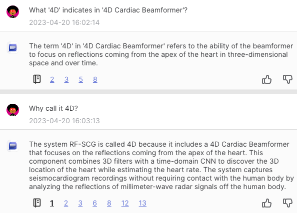
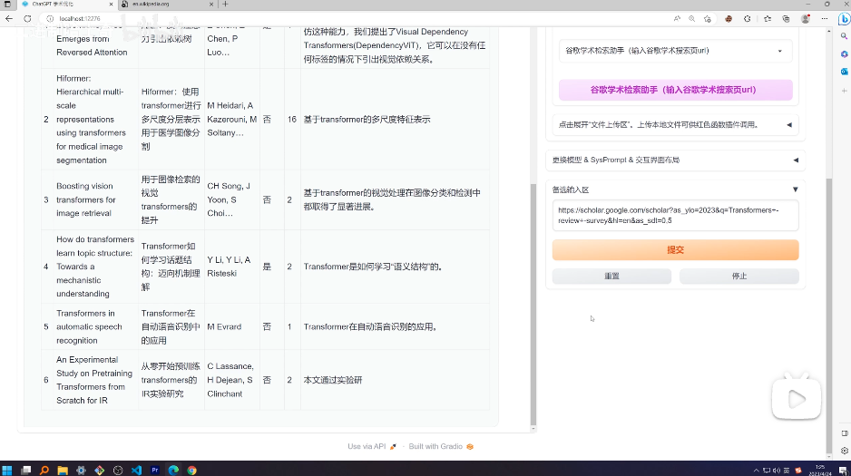
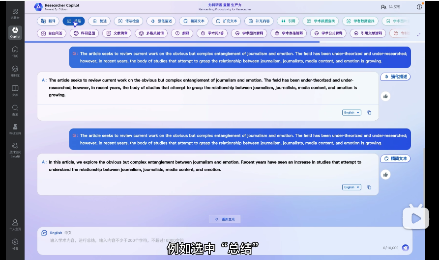

# AI Helps Reading Documents

Rating of the contents

| Name             | Rating | Keywords                         | Date       | Ref       |
| ---------------- | ------ | -------------------------------- | ---------- | --------- |
| ChatDoc          | 🌟🌟🌟    | Showing related parts;           | 2023-03-28 | ST_RD_001 |
| chatgpt-academic | 🌟🌟🌟🌟   | Summary all papers in a webpage; | 2023-04-24 | ST_RD_002 |
|                  |        |                                  |            |           |

## `ST_RD_001` ChatDoc: Chat with documents, get answers with cited sources

[ChatDOC - Chat with your documents](https://chatdoc.com/)

### Duke's Initial Trial:

I let it reads "Contactless Seismocardiography via Deep Learning Radars" by Unsoo Ha et al.

I asked "What '4D' indicates in '4D Cardiac Beamformer'?"

I'd reckon its feedback is not very satisfactory. One have to read the paper him/herself to get the hint of such a subtle concept.

But it will show you which part of the paper its answers are derived from, this is handy when you asking not so hard a question. Save your time to look for the question-related part yourself.

## `ST_RD_002` chatgpt-academic: reading all papers in a google scholar page and generate summary

[学术chatgpt一键聚合文献+写RelatedWorks【chatgpt-academic】_哔哩哔哩_bilibili](https://www.bilibili.com/video/BV1GP411U7Az/?spm_id_from=333.999.0.0&vd_source=57ac3ae5415445af2ffe1e61e1722d73)

Using this platform, you can provide a link to a Google Scholar search result page, and let AI read all the paper for you.

You can then ask the AI to create a report, and ask the AI to write it in latex in an academic way.

## `ST_RD_003` Research Copilot: GPT for academic paper formulating and question answering

[Researcher Copilot，更适合中国宝宝体质的科研GPT！_哔哩哔哩_bilibili](https://www.bilibili.com/video/BV1Nk4y1a7Xb/?spm_id_from=pageDriver&vd_source=57ac3ae5415445af2ffe1e61e1722d73)

It can generate structed content from a PDF file and supporting Q&A to get accurate answers from a paper to the question you want to know.

Also multiple functions are supported, so it is also an AI platform for academic research.

