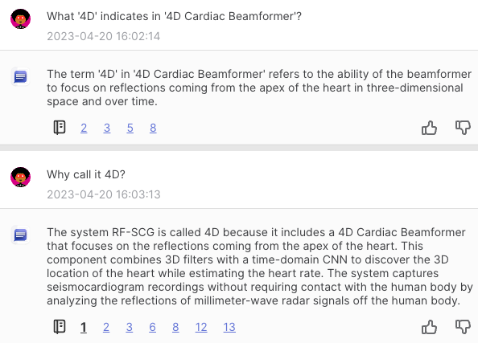

# AI Helps Reading Documents

Rating of the contents

| Name    | Rating | Keywords               | Date       | Ref       |
| ------- | ------ | ---------------------- | ---------- | --------- |
| ChatDoc | 🌟🌟🌟    | Showing related parts; | 2023-03-28 | GI_HF_001 |
|         |        |                        |            |           |
|         |        |                        |            |           |

## ChatDoc: Chat with documents, get answers with cited sources

[ChatDOC - Chat with your documents](https://chatdoc.com/)

### Duke's Initial Trial:

I let it reads "Contactless Seismocardiography via Deep Learning Radars" by Unsoo Ha et al.

I asked "What '4D' indicates in '4D Cardiac Beamformer'?"

I'd reckon its feedback is not very satisfactory. One have to read the paper him/herself to get the hint of such a subtle concept.

But it will show you which part of the paper its answers are derived from, this is handy when you asking not so hard a question. Save your time to look for the question-related part yourself.

